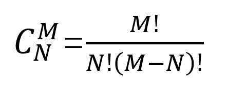

## **基础函数语句**

### for-in循环
如果明确知道一个循环执行的次数，推荐使用`for-in`循环，例如下面我们要求1~100的和。

```python
#sum of 1~100

sum = 0
for x in range(101):
    sum += x
print(sum)
```

上面range(101)表示的是从1到100的整数，有了这个范围我们就把它放在`for-in`循环中。range有如下使用方式：

- `range(101)`：产生0到100范围内的整数，取不到101。
- `range(1,101)`: 可以用来产生1到100的整数，前闭后开。
- `range(1,101,2)`: 1到100的奇数，2是步长，即每次数值递增的值。
- `range(100,0,-2)`: 100到1的偶数，步长为-2，即每次递减的值。

我们用以上知识来求0~100的偶数和：

```python
#sum of even number from 0 to 100.

sum = 0
for x in range(0,101,2):
    sum += x
print(sum)

#another code:(其中"%"这个运算符意义是取模，即返回两数相除的余数）

sum = 0
for x in range(1, 101):
    if x % 2 == 0:
        sum += x
print(sum)

```

我们来举一个非常实用的例子，比如我们想要**随机**掷骰子10000次，然后统计出每一个点数最后实现的数量。我们应该做如下操作：

```python

import random

counters = [0] * 6
# 这样我们就先得到一个列表counters = [0, 0, 0, 0, 0, 0]，其中每一个元素就是之后我们想要的点数实现数量。
for _ in range(10000):
    face = random.randint(1, 6)
    # 此处的区间里，1-6的整数均可取，和切片不一样。
    counters[face - 1] += 1
    # 此处则要考虑索引原则，比如现在点数是4，那么counters[3] = counters[3] + 1, 而counters的元素是由0开始的。
for face in range(1, 7):
    # range()要考虑索引原则，左取右不取。
    print(f'{face}点出现了{counters[face - 1]}次')
```

### while循环

如果不知道具体的循环次数的循环结构，那么建议使用`while`循环。`while`循环通过一个能产生或者转换出`bool`值的表达式来控制循环，如果表达式的值为`True`则继续循环；如果`False`就结束循环。我们以下面的0-100的猜字游戏来讲解。

```python

import random

answer = random.randint(1,100)
counter = 0
while True:
    counter += 1
    number = int(input('enter your number: '))
    if number < answer:
        print("guess a bigger one")
    elif number > answer:
        print("guess a smaller one")
    else:
        print("congratuations, you are right")
        break
print('you have guessed %d times' %counter)
if counter > 5:
    print("please top up your IQ")
```

### 函数的应用
本版块内容照抄**jackfrued**的函数和模块的例子，因为这个例子实在不错。
首先来看一道数学题，然后思考一下该方程有多少组正整数解。【可能因为VPN因素看不到图片】


应该能想到这是一个排列组合的问题，问题的本质相当于将8个苹果分成4组，每组至少要有1个苹果， 总共有多少种方案。再等价于8个人占位，有7个空隙与3个隔板，总共多少种方案。答案应该用`C(7,3)=35`来解决。**高中知识，真的有忘记**


如果我们用while循环来做计算，那么可能会有如下代码：

```python
m = int(input('m = '))
n = int(input('n = '))
#计算m的阶乘
fm = 1
for num in range(1, m + 1):
    fm *= num
#计算n的阶乘
fn = 1
for num in range(1, n + 1):
     fn *= num
#计算m-n的阶乘
fm_n = 1
for num in range(1, m - n + 1):
      fm_n *= num
#计算C(M,N)的值
print(fm//fn//fm_n)
```
我们可以看出，虽然以上的代码可以算出最后的结果，但是我们不断在重复对【x】的阶乘运算编程，导致很多重复，这个时候就要思考是否使用函数会更加高效呢。我们以下面的例子进行说明：

```python
#定义函数：def是定义函数的关键字，fac是函数名，num是自变量参数
def fac(num):
    result = 1 
    for n in range(1, num + 1):
        result *= n 
    #返回num的阶乘（因变量）
    return result
    
m = int(input('enter your m: '))
n = int(input('enter your n: '))
#这个时候我们已经定义了fac这个函数，需要用它的时候调用即可，在函数()输入想要用的实参即可。
print(fac(m)//fac(n)//fac(m-n))

